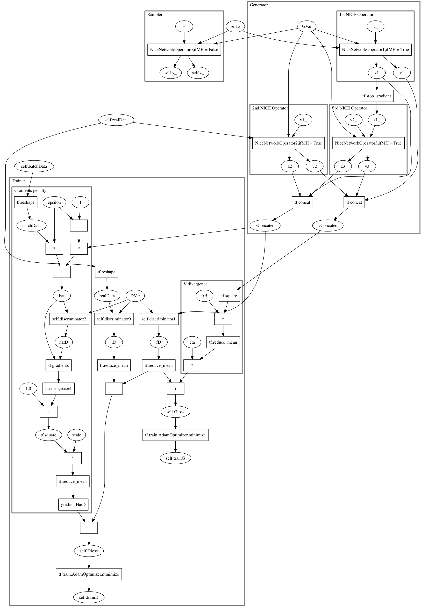

# NICEMC playground

This project is a re-write of original [NICEMC program](https://github.com/ermongroup/a-nice-mc).

## How to 

examples can be found in *testscript* folder.

#### Test Ring2D model

##### HMC and Metropolis-hasting

Run `python testscript/Normalsampler.py` at the root directory.

##### NICE-MC

Run ` python testscript/NICEtrain.py` to train. In the file, change `ifload` at line 35 to True to load parameters from previous training.

Run `python testscript/NICEsampler.py` to sample. In the file, change `ifload` at line 51 to True to load parameters from previous training.

#### Test Phi4 model

##### HMC and Metropolis-hasting

Run `python testscript/Normal_phi4sampler.py` 

##### NICE-MC

Run `python testscript/NICE_phi4.py` to train, In the file, change `ifload` at line 36 to True to load parameters from previous training.

Run `python testscript/NICE_phi4sampler.py` to sample. In the file, change `ifload` at line 54 to True to load parameters from previous training.

#### Your own model

##### Write model file

In `__init__` function, a `self.z` of tf.placeholder should be implemented, a `self.name` of string should be assigned, and should have default value.

In `__call__` function, a z will be given to `self.z`. Return is the energy of the model of z configuration.

##### Write trainer file

A `piror` function should be implemented to initialize configuration z. Then a model instance shoulde be initialize. Then initialize NICE network by first create a instance of `NiceNetwork` and then initialize it layer by layer using NiceNetwork's `append` method. A discriminator should be create whose inputs has twice the size of energy model's z and return a single float. Then create a `NICEMCsampler` instance. Then, use `NICEMCsampler.train` to train. The pseudocode should look like:

```python
if __name__ == "__main__":
    import sys
    import os
    sys.path.append(os.getcwd())
import tensorflow as tf
import numpy as np
from NICE.niceLayer import NiceLayer,NiceNetwork
from NICEMC.NICEMC import NICEMCSampler
from model.yourModel import yourModel
from utils.mlp import mlp
'''Setting model's size'''
zSize = yourzSize
'''define sampler to initialize'''
def prior(batchSize):
    return np.random.normal(0,1,[batchSize,zSize])
mod = yourModel()
'''Define the NICE-MC sampler'''
m = 2
b = 8
ifload = False
ifsummary = True
net = NiceNetwork()
niceStructure = [([[zSize,1stlayerSize],...[1stlayerSize,zSize]],1stlayerName,1stlayerActive,ifchangeXV),...]
discriminatorStructure = [[2*zSize,1stlayerSize],[1stlayerSize,2ndlayerSize]...]
for dims, name ,active, swap in niceStructure:
    net.append(NiceLayer(dims,mlp,active,name,swap))
dnet = mlp(discriminatorStructure,leaky_relu,"discriminator")
sampler = NICEMCSampler(mod,prior,net,dnet,b,m,pathtoSavedFolder,pathtoSummaryFolder)
'''Start training'''
print("Training NICE for "+sampler.energyFn.name)
sampler.train(epochSteps,totalSteps,bootstrapSteps,bootstrapBatchSize,bootstrapBurnIn,logSteps,evlBatchSize,evlSteps,evlBurnIn,dTrainSteps,trainBatchSize,saveSteps,ifsummary,ifload)
```

##### Write sampler file

Basically the same as trainer file, only after initialize an instance of `NICEMCsampler` use `NICEMCsampler.sample` to sample. Use `autoCorrelationTime` and `acceptance_rate` to evaulate samples.  The pseudocode should look like:

```python
if __name__ == "__main__":
    import sys
    import os
    sys.path.append(os.getcwd())
import tensorflow as tf
import numpy as np
from NICE.niceLayer import NiceLayer,NiceNetwork
from NICEMC.NICEMC import NICEMCSampler
from utils.autoCorrelation import autoCorrelationTime
from utils.acceptRate import acceptance_rate
from model.yourModel import yourModel
from utils.mlp import mlp
'''Setting model's size'''
zSize = yourzSize
'''define sampler to initialize'''
def prior(batchSize):
    return np.random.normal(0,1,[batchSize,zSize])
'''Define the model to evaluate'''
mod = yourModel()
'''Define the same NICE-MC sampler as in training'''
m = 2
b = 8
net = NiceNetwork()
niceStructure = [([[zSize,1stlayerSize],...[1stlayerSize,zSize]],1stlayerName,1stlayerActive,ifchangeXV),...]
discriminatorStructure = [[2*zSize,1stlayerSize],[1stlayerSize,2ndlayerSize]...]
for dims, name ,active, swap in niceStructure:
    net.append(NiceLayer(dims,mlp,active,name,swap))
dnet = mlp(discriminatorStructure,leaky_relu,"discriminator")
sampler = NICEMCSampler(mod,prior,net,dnet,b,m,pathtoSavedFolder,pathtoSummaryFolder)
'''Starting sampling'''
TimeStep = TimeStep
BatchSize = BatchSize
BurnIn = BurnIn
bins = bins
ifload = ifyourWant2loadPreviousTraining
z,v = sampler.sample(TimeStep,BatchSize,ifload,True)
z = z[BurnIn:,:]
z_ = z[-1,zSize]
print("mean: ",np.mean(z))
print("std: ",np.std(z))
zt = np.mean(z,2)
autoCorrelation = autoCorrelationTime(zt,bins)
acceptRate = acceptance_rate(z)
print('Acceptance Rate:',(acceptRate),'Autocorrelation Time:',(autoCorrelation))
```


**Run all script in root directory of project**

## Test Result

### Ring2D

After 200'000 iterations of training of NICE-MC, sampling 800 samples of Ring2D model with a batch size of 100, drop first 300 samples. HMC, MH and NICE-MC yields:

| Algor.       | mean        | std     | accept. | autocor. t     |
| :----------- | ----------- | ------- | ------- | -------------- |
| MH           | 0.00358582  | 1.45522 | 0.3388  | 13.9674        |
| HMC          | -0.00969827 | 1.45031 | 0.9923  | 6.46388        |
| NICE-MC      | 0.00226861  | 1.45189 | 0.6668  | -0.0995518 (?) |
| Ground truth | 0           | 1.456   | NA      | NA             |

### Phi4

Evaluating $ 3\times3, \kappa=1, \beta = 1 $ Phi4. 

After 200'000 iterations of training of NICE-MC, sampling 800 samples of Phi4 model with a batch size of 100, drop first 300 samples. HMC, MH and NICE-MC yields:

| Algor.  | mean       | std     | accept. | autocor. t |
| :------ | ---------- | ------- | ------- | ---------- |
| MH      | 0.164351   | 1.96883 | 0.00642 | 12.791     |
| HMC     | -0.421223  | 2.07029 | 0.8738  | 1.68466    |
| NICE-MC | -0.0109525 | 2.11119 | 0.33646 | 0.893479   |

## Project Folder Tree

```
├── Metropolois     # Calculate the Metropolis acceptance ratio
│   └── Metropolis.py  
├── NICE            # Implement of NICE network
│   └── niceLayer.py
├── NICEMC          # Implement of NICE-MC, especially GAN part
│   └── NICEMC.py	
├── README.md       # This readme file
├── demo            # Saving for demo play, models are specified by different folders
│   ├── Ring2d
│   │   └── checkpoint
│   └── phi4
│       └── checkpoint
├── etc             # Some files to serve readme file
│   ├── log.md
│   └── note.md
├── hmc             # Implement of Hydird Monte Carlo
│   └── hmc.py
├── model           # Implements of different energy model
│   ├── Ising.py
│   ├── TGaussian.py
│   ├── correlationDoubleGaussian.py
│   ├── correlationTGaussian.py
│   ├── doubleGaussian.py
│   ├── phi4.py
│   └── ring2d.py
├── savedNetwork    # Store savings for training, models are specified by different folders
│   ├── Ring2d
│   │   └── checkpoint
│   ├── phi4
│       └── checkpoint
├── testscript      # Test scripts
│   ├── NICE_phi4.py
│   ├── NICE_phi4sampler.py
│   ├── NICEsampler.py
│   ├── NICEtrain.py
│   ├── Normal_phi4sampler.py
│   └── Normalsampler.py
├── tfSummary       # Store summary files of tensorboard
│   └── placeholder
└── utils           # Some scripts used
	├── MetropolisHastingsAccept.py
	├── acceptRate.py
	├── autoCorrelation.py
	├── expLogger.py
	├── hamiltonian.py
	├── mlp.py
	└── parameterInit.py
```

## Saving Structure

By default, NICE network savings can be found at *savedNetwork* folder and tensor flow summary files at *tfSummary* folder. Demo savings can be found at *demo* folder. In *savedNetwork* folder, different models are stored in different folders naming after energy model's name when training.

### demo

Move all folders at *demo* folder to *savedNetwork* folder and configure `ifload = True`to use demo savings.

## GAN Computational Graph



## About NICE network and NICE-MC 

See etc/note.md or the original paper at https://arxiv.org/abs/1706.07561 and https://arxiv.org/abs/1410.8516