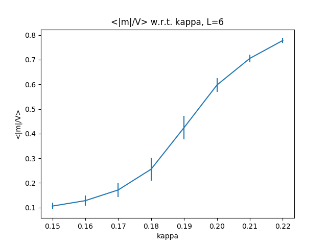
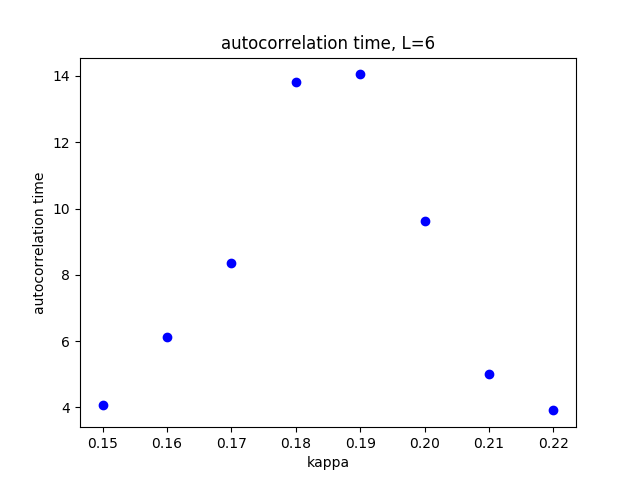

## 2017. 9. 17 Sun.

### Done 

1. Debug NICE/nicelayer.py, add "reversed" at class NiceNetwork/backward.
2. Train NICEMC, run NICEMC/NICEME.py for about 10'000 iterations, the acceptance ratio maximum at about 47%, as contrast, the original program's acceptance can be about 60%~70%.

### TODO

1. Find if the acceptance ratio difference is casued by bad initialization. 
2. Keep train to see if acceptance ratio can go higher
3. Do some work about benchmark

## 2017. 9. 18 Mon.

### Done

1. Train NICEME, run NICEME/NICEMC.py for 200'000 iterations, acceptance ratio still stuck at 48% at most.
2. Using my NICEME/NICEMC.py and original nicelayer (a_nice_mc/utils/nice.py) is ok (60% acceptance ratio or higher), so maybe NICE/nicelayer still has bugs?
3. Use tf.contrib.layers's fully_connected instead of utils/mlp.py still yielded acceptance ratio below 60%(~48%)
4. At least, sample without training seems right (using testNicemc.py without loading).
5. Add more test to NICE/nicelayer.py, now takes Jacobian into account.
6. Debug nice layer, the bias was added outside of active function. After debug, and after 5'000 iterations, acceptance ratio can high as ~60%.


### TODO

1. Train it ti see if it can perferm as well as original.
2. Benchmark

## 2017. 9. 19 Tue.

### Done

1. Train NICEMC/NICEMC.py for 200'000 iterations, acceptance ratio can be up to 73%, Train original NICE-MC the acceptance ratio can be up to about 75%. 

2. After training, run testNicemc.py, the result is:

   autoCorrelation:  -0.111961132942 acceptRate:  0.70292
   mean: -0.0127335
   std: 1.4507
   mean: -0.0150352
   std: 1.46035 

3. Debug: save parameter at end of all iterations.

### TODO

1. separate test to a single file as training script.
2. add matplotlib to plot training

## 2017. 9. 20 Thu. 

### Done

1. Test phi4 model, original yield maximum acceptance ratio of ~30% for training about 100'000 iterations. 
2. Clear code for easy read. Move all test script into test script folder.
3. Test phi4 model, my implement yield maximum acceptance ratio of ~12% for 10'000 iterations.


## 2017. 9. 30 Mon.

1. Test phi4 model, add scripts for test HMC and MH on phi4 model

2. Test phi4 model on 3D configuration

3. Test triaining NICE- MC on 3D phi4

4. Debug phi4, mistake kappa for lambda

5. Run phi4 on 3 * 3 * 3 scale using tutorial's C program, log as following(Ground truth):

   ```
   0.15
   MEAS 10000 0.270652
   EXPDH 9.952436e-01
   Phi4:-1.324790  -1.291028  -1.183909  -1.123427  -0.679336  -0.465309  -1.102690  -0.648832  -0.245129  -1.101888  -1.218702  -0.870635  -1.016881  0.468447  -0.545430  -1.146248  -1.330662  0.118707  0.662888  0.045914  1.025505  -0.680981  -0.964450  -0.344261  -0.395588  -1.021707  0.358026
   Phi4:-0.285734  -0.376600  -0.360196  -0.348216  -1.058170  -1.088533  -0.698222  -1.148118  -0.659415  -0.661883  -0.006936  -0.757454  -0.608142  0.459741  0.551678  -0.579494  -0.027229  0.703929  -0.800496  -1.167618  0.291354  0.390313  -0.770997  -1.113549  -0.994910  -0.696999  0.962957
   Phi4:-1.303042  -0.835136  -1.157062  -0.702809  -0.632123  -0.298993  -0.742027  -0.581305  -0.125384  -1.133610  -1.329184  -0.598707  -0.918561  0.841540  0.888102  -1.136930  -0.323476  0.874026  -0.904778  -0.385541  -0.138481  0.819267  -0.874591  -0.224239  -0.502854  -0.825390  0.437334
   Phi4:-0.171000  -0.405322  0.298716  -1.054601  -0.936741  -1.227943  -1.056443  -1.123248  -1.139266  -0.629852  0.149291  0.728720  -0.583557  0.513843  0.475165  -0.427176  0.047108  0.655581  -0.548583  0.948744  -0.174378  0.490509  0.056451  -0.402215  -0.886421  -0.743839  0.046605
   Phi4:-1.068356  -1.150793  -1.019785  -0.699390  -0.684793  -0.183828  -0.652587  -0.182110  0.514676  -0.867790  -0.439540  -0.099171  -0.824062  0.487002  0.752510  1.110738  0.654714  0.924544  -1.075602  -0.407468  -1.231710  0.771765  1.249803  -0.942741  -0.789693  -0.324924  -1.214976

   0.16
   MEAS 10000 0.292796
   EXPDH 1.002000e+00
   Phi4:0.660427  -0.788548  -0.511972  -0.411213  -0.901567  -0.683224  -0.741965  -1.294627  -0.832365  -0.199586  -0.853485  -1.363479  0.315783  0.225392  -1.158015  -0.787429  -0.948811  -0.152355  -0.758276  0.043779  -0.142368  -1.024811  -1.441874  -0.726921  -1.258199  -1.166525  0.709673
   Phi4:-0.511254  -0.964137  -0.537792  -1.145116  -0.643646  -1.131212  -0.859310  -0.163848  -0.488918  -0.547644  -0.316800  -0.138533  0.414958  -0.735997  -0.538880  -0.902609  -0.878254  -1.057354  -0.960194  -0.890259  -1.320932  -0.608492  0.099309  -0.928743  -0.399808  -0.483961  0.511697
   Phi4:-0.276787  -0.740017  -1.055816  -0.542004  -0.244785  -0.330976  0.634818  1.074543  -0.139062  -1.128921  -1.367012  -0.213685  -0.704044  -0.893907  -1.184346  -0.423401  -0.525792  -0.665146  -0.985015  -0.957895  -0.216952  -0.985247  -1.483331  -0.691042  -1.226545  -1.136694  0.435087
   Phi4:-1.226351  0.181965  -0.732290  -0.818869  1.209396  -0.938577  -0.469318  -0.345291  -1.170470  -0.687870  -0.194096  -1.328261  -0.781892  -0.944246  -0.627939  -1.217321  -1.052516  -1.097539  -0.884832  -0.839050  -0.327050  -0.600293  0.237198  -1.042021  -0.162242  -0.433636  0.311281
   Phi4:-1.226351  0.181965  -0.732290  -0.818869  1.209396  -0.938577  -0.469318  -0.345291  -1.170470  -0.687870  -0.194096  -1.328261  -0.781892  -0.944246  -0.627939  -1.217321  -1.052516  -1.097539  -0.884832  -0.839050  -0.327050  -0.600293  0.237198  -1.042021  -0.162242  -0.433636  0.311281

   0.18
   MEAS 10000 0.424667
   EXPDH 9.969801e-01
   Phi4:-0.593075  0.684787  -0.570334  1.438110  0.749284  -0.001373  -1.144860  -0.231208  -0.743141  0.530892  0.772228  -0.604219  1.423601  0.277069  0.453075  1.009973  0.473823  0.619947  1.207370  1.260017  -0.507801  1.238214  1.234354  0.513940  0.497841  0.698879  0.948735
   Phi4:-0.340198  0.639007  -0.680985  -0.823763  0.975755  0.964962  0.227813  -1.110548  -0.774986  1.125815  0.546180  0.388016  -0.042683  1.190607  0.400735  0.832443  0.170827  0.578554  0.361402  -0.086450  -0.293652  0.623112  0.560382  1.074679  1.061789  0.994947  0.824094
   Phi4:-0.144249  0.850111  0.993818  -0.137486  0.590570  0.719837  0.575413  0.649530  -0.408490  0.688972  1.206852  1.307160  1.171227  0.761293  0.955057  1.071591  1.439248  0.888267  1.290244  1.520187  1.047543  1.208069  1.297668  0.757289  0.957972  0.768679  0.578518
   Phi4:-0.358320  0.489828  -0.005106  -0.780827  -0.522490  0.566356  -0.203562  0.985489  -0.831807  1.006255  0.490083  0.370994  0.189204  1.053448  0.959049  0.772229  0.232407  0.994133  0.350463  -0.160195  0.900826  0.151223  0.460025  1.107946  -0.093349  1.188388  0.990766
   Phi4:-0.363338  0.466273  -1.121557  -0.642521  1.286428  -0.883109  0.870793  0.612115  -0.016208  0.565858  0.166833  1.199452  0.957972  0.795033  0.858607  1.101328  0.933824  0.748123  0.621022  1.168724  0.442976  1.044468  1.266693  0.690876  1.442418  0.562423  0.380408

   0.20
   MEAS 10000 0.584304
   EXPDH 1.002245e+00
   Phi4:-0.203450  0.910187  -0.342052  -0.972005  0.630750  -1.412277  0.735917  -0.656544  0.715698  -0.924360  -1.246402  -0.582702  -0.566805  -1.300487  -0.835631  0.813577  0.122442  1.183684  -0.156284  -0.473771  -1.074102  -0.856624  -0.506583  -0.354504  0.760289  1.346342  0.861837
   Phi4:-0.203450  0.910187  -0.342052  -0.972005  0.630750  -1.412277  0.735917  -0.656544  0.715698  -0.924360  -1.246402  -0.582702  -0.566805  -1.300487  -0.835631  0.813577  0.122442  1.183684  -0.156284  -0.473771  -1.074102  -0.856624  -0.506583  -0.354504  0.760289  1.346342  0.861837
   Phi4:-0.957000  -0.106891  -1.123868  -0.563934  0.594970  1.117504  1.024365  1.593775  1.048457  -0.722893  -0.178585  -1.136174  -1.116807  -0.173596  -0.579856  0.592718  0.872553  0.283507  0.359076  -1.116042  -0.515023  -0.126641  -1.064953  -1.181443  1.039803  -0.355903  0.855747
   Phi4:-0.957000  -0.106891  -1.123868  -0.563934  0.594970  1.117504  1.024365  1.593775  1.048457  -0.722893  -0.178585  -1.136174  -1.116807  -0.173596  -0.579856  0.592718  0.872553  0.283507  0.359076  -1.116042  -0.515023  -0.126641  -1.064953  -1.181443  1.039803  -0.355903  0.855747
   Phi4:-0.524875  -1.356836  -0.433825  0.950831  -0.274998  0.216282  0.204816  -1.200792  0.720435  -0.523925  -1.186253  -0.646259  -0.598290  -1.323568  -1.073963  -0.271282  -0.025773  0.572868  0.761966  -0.574741  -1.060492  -1.154351  -0.263079  -0.025579  0.670494  -1.069930  0.718412

   0.22
   MEAS 10000 0.744574
   EXPDH 1.000467e+00
   Phi4:1.020711  1.152802  0.459557  0.523378  1.219005  1.440440  1.241415  0.962674  0.376113  -0.974064  0.874512  1.217300  0.702655  1.152332  0.704671  1.200882  1.167709  0.782804  -0.489425  1.177302  0.081357  0.084244  1.199246  0.688465  1.197401  0.990106  0.353563
   Phi4:1.020711  1.152802  0.459557  0.523378  1.219005  1.440440  1.241415  0.962674  0.376113  -0.974064  0.874512  1.217300  0.702655  1.152332  0.704671  1.200882  1.167709  0.782804  -0.489425  1.177302  0.081357  0.084244  1.199246  0.688465  1.197401  0.990106  0.353563
   Phi4:0.525306  0.904008  1.371838  0.333462  0.703072  0.192220  0.709308  1.144759  1.296953  1.104051  1.048525  0.572663  1.112638  0.720428  1.294261  0.716099  0.974114  1.227956  -0.384548  0.634785  1.134518  1.077953  0.435079  1.210352  0.168573  0.890420  1.152742
   Phi4:1.211455  1.059107  0.512764  1.173819  1.178248  1.467983  1.087907  0.922564  0.488028  0.515166  0.949091  1.108888  0.725250  1.221198  0.626136  1.164796  1.120907  0.661211  -0.744289  0.147616  0.614901  0.691592  -0.283544  0.585271  1.319098  0.977970  0.166499
   Phi4:0.602391  0.857848  1.227073  0.861458  0.808544  0.208426  0.969919  1.098114  1.336273  0.875906  0.899095  0.797552  1.031264  0.716182  1.278044  0.810056  0.917134  1.297253  0.564241  -0.633955  0.377309  1.063826  1.425343  1.269517  0.423399  0.763746  1.217828
   ```

   ​

## 2017. 10. 1 Sat.

1. Run phi4 on 6 * 6 * 6 scale, plot and data as following:

   ```
   kappa: 0.15
   measure: <|m|/V> 0.10634 with error: 0.0138182
   Acceptance Rate: 0.8951 Autocorrelation Time: 4.06896
   kappa: 0.16
   measure: <|m|/V> 0.128318 with error: 0.0199177
   Acceptance Rate: 0.89364 Autocorrelation Time: 6.12739
   kappa: 0.17
   measure: <|m|/V> 0.171751 with error: 0.0284354
   Acceptance Rate: 0.88976 Autocorrelation Time: 8.34371
   kappa: 0.18
   measure: <|m|/V> 0.255941 with error: 0.0457239
   Acceptance Rate: 0.88974 Autocorrelation Time: 13.8243
   kappa: 0.19
   measure: <|m|/V> 0.424544 with error: 0.0470411
   Acceptance Rate: 0.88128 Autocorrelation Time: 14.0445
   kappa: 0.2
   measure: <|m|/V> 0.597331 with error: 0.0286152
   Acceptance Rate: 0.8722 Autocorrelation Time: 9.62806
   kappa: 0.21
   measure: <|m|/V> 0.705294 with error: 0.0149205
   Acceptance Rate: 0.86116 Autocorrelation Time: 5.02386
   kappa: 0.22
   measure: <|m|/V> 0.777846 with error: 0.010144
   Acceptance Rate: 0.85396 Autocorrelation Time: 3.91165
   measure: <|m|/V>
   [0.10634033, 0.12831813, 0.17175061, 0.25594056, 0.42454362, 0.59733146, 0.70529354, 0.77784646]
   error:
   [0.0138182, 0.0199177, 0.0284354, 0.0457239, 0.0470411, 0.0286152, 0.0149205, 0.010144]
   autocorrelation t:
   [4.06896, 6.12739, 8.34371, 13.8243, 14.0445, 9.62806, 5.02386, 3.91165]
   ```



